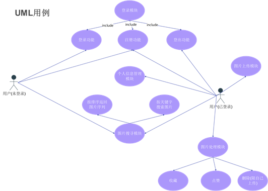

# 系统建模报告

## 用例图

## 类图

## E-R图

## 数据库设计

### USER  

| 表名：USER |        |          |                      |
| ---------- | ------ | -------- | -------------------- |
| 字段名     | 中文名 | 类型     | 说明                 |
| Id         | 用户id | Int      | unique,  primary key |
| Username   | 用户名 | Varchar  | unique               |
| Email      | 邮箱   | Char(40) |                      |
| Birthday   | 生日   | Char(15) |                      |
| Sex        | 性别   | Char(1)  |                      |
| Country    | 国籍   | Char(30) |                      |
| Wechat     | 微信   | Char(50) |                      |

### PICTURE  

| 表名：PICTURE |        |          |                      |
| ------------- | ------ | -------- | -------------------- |
| 字段名        | 中文名 | 类型     | 说明                 |
| pid           | 图片id | Int      | unique,  primary key |
| Imgname       | 图片名 | Varchar  |                      |
| Size          | 尺寸   | Int      |                      |
| Uploader      | 上传者 | Char(15) |                      |
| Numlike       | 点赞数 | Int      |                      |
| Num_start     | 收藏数 | Int      |                      |
| Num_view      | 浏览数 | Int      |                      |

### FAVOURITE  

| 表名：FAVOURITE |        |      |                        |
| --------------- | ------ | ---- | ---------------------- |
| 字段名          | 中文名 | 类型 | 说明                   |
| pid             | 图片id | Int  | 外键约束：PICTURE(Pid) |
| User            | 点赞人 | Int  | 外键约束：USER(id)     |

### TAG  

| 表名：TAG |        |          |             |
| --------- | ------ | -------- | ----------- |
| 字段名    | 中文名 | 类型     | 说明        |
| Tid       | 标签id | Int      | Primary key |
| Tname     | 标签名 | Char(20) |             |

### PICTOTAG  

| 表名：PICTOTAG |        |      |                      |
| -------------- | ------ | ---- | -------------------- |
| 字段名         | 中文名 | 类型 | 说明                 |
| Tag_id         | 标签id | Int  | 外键约束TAG(Tid)     |
| Pid            | 图片id | Int  | 外键约束PICTURE(Pid) |
