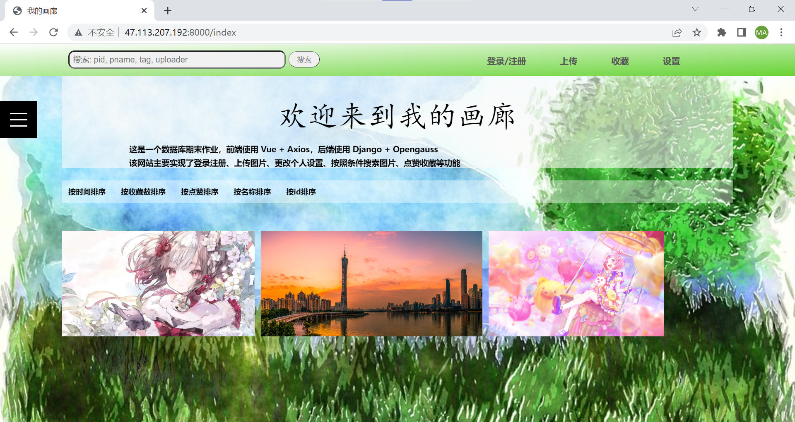
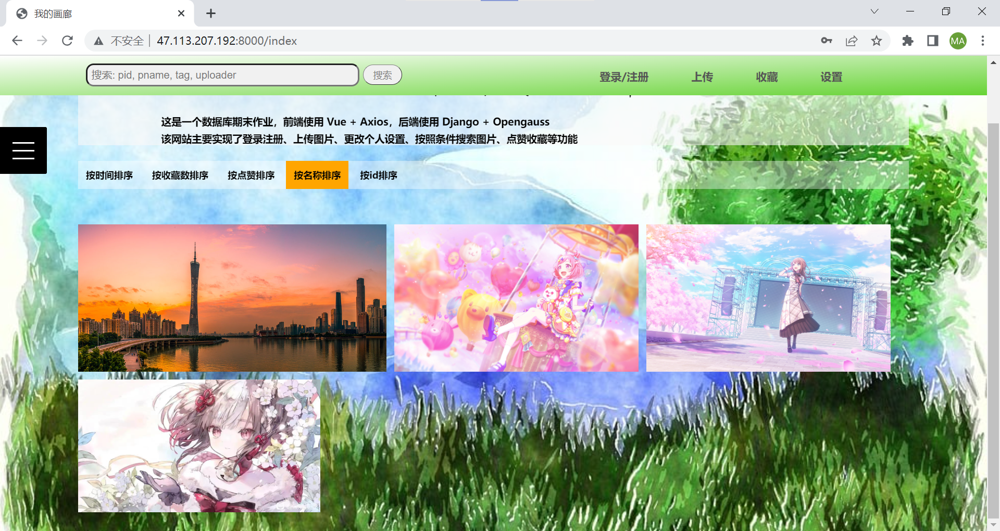

# 软件测试与质量保证报告

## 测试计划

在本项目中，我们基于功能需求进行测试，以确保能够满足用户的需求以及处理异常情况。

## 测试用例

### 注册功能

#### 注册成功

注册新的账号"New"，并设置密码为"123qwe"。网页显示"注册成功"：

#### 注册失败

- 重复注册账号"New"，网页显示"用户名已存在"：

  

- 注册用户名不符合要求，提示正确的用户名格式：

  

- 注册密码不符合要求，提示正确的密码格式：

  

### 登录功能

#### 登录成功

输入正确的用户名"New"和密码"123qwe"，网页显示登录成功：

#### 记住登录状态

用户"New"重复登录，网页显示"已经登录了"：

#### 登录失败

- 输入错误的密码，如将用户名"New"的密码输入为"123123"，网页显示用户名或密码错误：

  

- 输入一个不存在的用户名"noexist"，网页显示用户名或密码错误：

  

### 上传图片

#### 上传成功

上传名字为"new"，标签为"game"的图片，并选择用户的本地图片"card_after_training(1).png"进行上传，点击上传后网页显示上传成功：

并能够在上传后看到新上传的图片：

- 上传前：

  

- 上传后：

  

也能够在个人收藏页面看到我的作品：

#### 取消上传

在我的作品中点击图片后，可以删除图片以取消上传：

#### 上传失败

没有选择图片或者输入名字，显示相应的提示：

### 登出功能

#### 登出成功

在已经登录的情况下，选择登出，才会登出成功：

#### 登出失败

在还未登录的情况下，选择登出，提示"还未登录"：

### 浏览图片功能

#### 查看细节

点击图片，即可查看图片细节：

#### 点赞图片

点击点赞按钮：

#### 收藏图片

点击收藏按钮：

并能够在个人收藏页面看到我的收藏：

#### 取消收藏

再次点击收藏按钮是取消收藏：

### 设置账号个人信息功能

#### 更改用户名

##### 更改成功

将"New"改为"old"：

- before:

  

- after:

  

##### 更改失败

新的用户名已存在：

#### 更改邮箱等其他信息

### 图片排序显示功能

#### 按时间排序

#### 按收藏数排序

#### 按点赞数排序

#### 按名称排序

#### 按 id 排序

### 关键词搜索功能

#### 按图片 id 搜索

`pid=1`

#### 按图片名字搜索

`pname=emu`

#### 按图片标签搜索

`tag=game`

#### 按上传者搜索

`uploader=old`

## 缺陷跟踪

尽管我们的项目已经完成了基本的功能，能够满足设计该项目的初衷(完成图片上传等功能)，也能够给予少量在线用户支持，但是，仍然有不够成熟的方面。

### 1 使用加密的传输网络协议(如https)替代明文传输的网络协议(http)

在实验中，我们使用明文对信息进行传输，直接使用http进行通讯，这样的操作具有安全隐患。倘若有别有用心的人通过抓包等方式截获通讯报文，就能够不费吹灰之力地获取到用户交流的信息，特别是一些敏感信息，例如用户的账号、密码等隐私信息。为此，我们应该改用更加安全的加密传输方式，https就是一个不错的选择。https并不是新的应用层协议，只是http不再直接跟tcp进行通信了，先跟ssl通信，再由ssl和tcp通信。用wireshark抓网卡中的数据包，http的请求是能看到明文数据的，https的请求看到的是乱码。这就避免了http传输过程中被窃听截取，或者冒充篡改。

### 2 对数据库中的用户密码部分进行加密存储

当前，我们在数据库中存储的密码只是简单地进行明文存储这样子的安全性显然是不够的。我们应该通过加密技术对原密码进行加密，再将加密后的密码存储到数据库中。最常用的加密方式无疑是MD5.MD5算法的原理可简要的叙述为：MD5码以512位分组来处理输入的信息，且每一分组又被划分为16个32位子分组，经过了一系列的处理后，算法的输出由四个32位分组组成，将这四个32位分组级联后将生成一个128位散列值。MD5算法的算法特点如下： （1）压缩性：任意长度的数据，算出的MD5值长度都是固定的。 （2）容易计算：从原数据计算出MD5值很容易。 （3）抗修改性：对原数据进行任何改动，哪怕只修改1个字节，所得到的MD5值都有很大区别。 （4）弱抗碰撞：已知原数据和其MD5值，想找到一个具有相同MD5值的数据（即伪造数据）是非常困难的。 （5）强抗碰撞：想找到两个不同的数据，使它们具有相同的MD5值，是非常困难的。当然，更加安全的做法是使用加盐的MD5.当用户首次提供密码时（通常是注册时），由系统自动对这个密码追加盐，然后再散列。而当用户登录时，系统为用户提供的密码追加同样的盐，然后散列，再比较散列值，已确定密码是否正确。所谓的盐就是一个随机生成的字符串，这个盐值是由系统随机生成的，并且只有系统知道。这样，即便两个用户使用了同一个密码，由于系统为它们生成的盐值不同，他们的散列值也是不同的。

### 3 改静态页面为动态页面

我们的项目中网页的加载主要通过静态页面加载的方式进行，这样，当加载所有图片(如主页)时就有可能出现加载时间过长、加载所占用空间过多等问题，不仅用户的等待时间变长、带宽被占用，对于服务器来说也是不小的压力，若图片数目较大则十分不利的。因此，我们最好采用AJAX、JSP等动态加载技术，不需要重新加载整个页面内容，就可以实现网页的局部更新，如当滚动鼠标滑轮时，网页才会从服务器数据库自动加载数据并渲染页面，这样子可以解决上述的问题。

## 质量保证方法

在此项目中，我们使用以下质量保证方法：

1. 对代码进行定期检查，以发现潜在的问题并加以改进。
2. 邀请其他同学使用我们的网站，并收集他们的意见和反馈，进而根据这些意见和反馈进行改进和优化。

